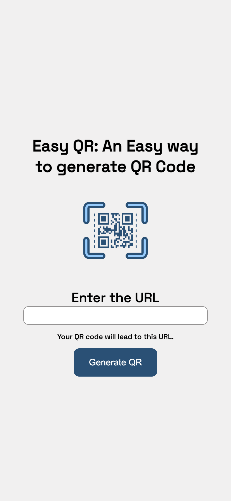

# Easy QR

This is my first full-stack project. I developed it to learn Node.js and Express.js. Easy QR allows you to generate a QR code for any URL. Simply enter the link you want your QR code to lead and click on the "Generate QR" button. A QR code will be displayed for you to download.

## Responsive Design

The design is also created by me and it takes account for a mobile-first workflow, adapting to all screen sizes.

## Video Demonstration

To watch a demonstration of the project, you can download the video file:

[](qr-code-runnning.mp4)


## Development Process

- Setting up the project starting files;
- Setting up the server side and the HTTP request methods;
- Making the HTML structure for the Home page;
- Downloading the necessary dependencies;
- Define the paths to the client-side files;
- Set up the necessary middleware and the controller for generating the QR Code;
- Testing the generation of the QR Code;
- Sending back the response;
- Making the HTML structure for the confirmation page;
- Styling the pages from a mobile-first workflow.

## Built with

- Semantic HTML5 markup;
- JavaScript;
- Node.js;
- Express.js;
- Mobile-first workflow;

## Technologies and Tools

- [HTML5](https://html.com)
- [CSS3](https://www.w3.org/Style/CSS/)
- [JavaScript](https://www.javascript.com)
- [Node.js](https://nodejs.org/en)
- [Express.js](https://expressjs.com)

## Requirements

To work with the code, you will need, before you begin, to install on your machine: NodeJs, and Git and to have a source-code editor such as [VSCode](https://code.visualstudio.com).
You will also need to download all the dependencies used in this project by using this command in your terminal:

```
npm install
```

To run de project on your machine, open http://localhost:3000/ in your browser, and on the terminal use de following command:
```
npm start 
```


## What I Learned

### What is Node.js and Express.js:

- It was interesting to know that we can build many things, not only web applications with node.js on the backend. It is a powerful runtime environment built on the V8 JavaScript engine that allows us to execute server-side code in our machine, outside of the browser. Also, Nodejs is asynchronous which means it doesn't block the execution of the entire program, instead, it works with promises to handle operations.  
- Express.js, a web framework for Node help us get things done easier, like, for example, setting up the routes and dealing with HTTP request, because it specializes in web development. Express is a dependency and therefore must be downloaded first and then set up for use:

~~~
import express from "express";

const app = express();
~~~

### How to set up the server-side in your machine with a localhost port

~~~
const port = 3000;

app.listen(port, () => {
    console.log(`Listening on port ${port}`);
});

export default IconOrImage
~~~

### How the HTTP requests work and how to set them up:
- HTTP ("Hypertext Transfer Protocol) is a message requested by a client/user to the server side. It follows a set of protocols that enable communication across the World Wide Web.
- HTTP also has methods(verbs) that specify the action to be performed by the server. Those are the most common methods:

GET: Retrieve data from the server.
POST: Submit data to be processed to a specified resource.
PUT: Update a resource or create a new resource if it does not exist.
DELETE: Request the removal of a resource.
PATCH: Apply partial modifications to a resource.

Here is an example of how to set it up:
~~~
app.get("/", (req, res) => {
    res.sendFile(homePage);
});

app.post("/submit", (req, res) => {
    res.sendFile(confirmationPage);
});
~~~

### Made with :heart: by [Caroline Almeida Nikolic](https://www.linkedin.com/in/carolinealmeidanikolic/)